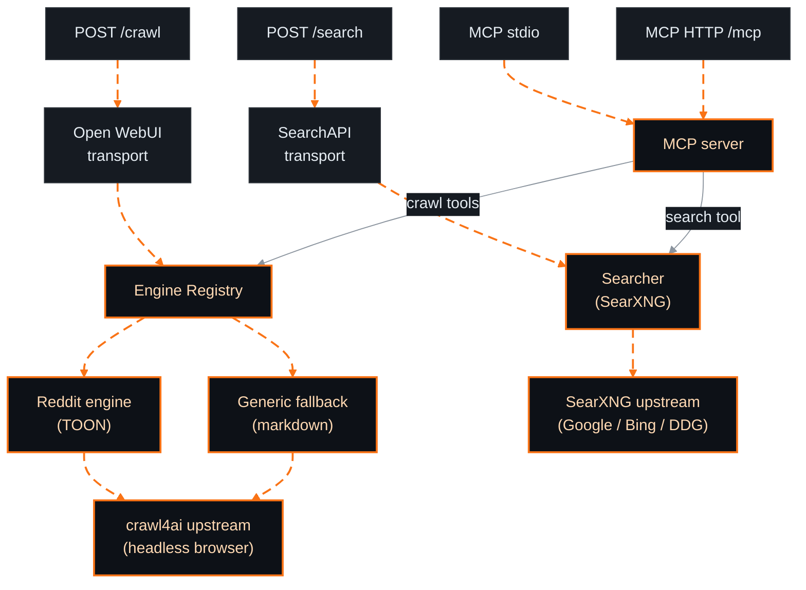

<!-- markdownlint-disable MD033 MD041 -->
<p align="center">
  
</p>

<p align="center">
  
</p>

<p align="center">
  <a href="https://github.com/kinorai/omnifeed/actions/workflows/ci.yml"></a>
  <a href="https://github.com/kinorai/omnifeed/releases"></a>
  <a href="https://hub.docker.com/r/kinorai/omnifeed"></a>
</p>

<p align="center">
omnifeed gives an AI agent the full research loop — <b>search → URLs → content</b> — against self-hosted
<a href="https://github.com/searxng/searxng">SearXNG</a> + <a href="https://github.com/unclecode/crawl4ai">crawl4ai</a>,
with a dedicated Reddit engine that returns <b>full comment trees as <a href="https://github.com/toon-format/toon">TOON</a></b>
(~40% fewer tokens than JSON, lossless) and <b>no Reddit API key</b>.
</p>

- **`web_search`** queries a SearXNG instance (Google/Bing/DDG, Reddit included) and returns ranked URLs with titles and snippets.
- **`fetch_url`** renders any URL through crawl4ai as clean markdown — and Reddit URLs come back as the full comment tree encoded in TOON.


##  Why omnifeed

| | omnifeed | Other Reddit MCPs |
|---|---|---|
| Web search → crawl in one self-hosted service | ✅ SearXNG + crawl4ai | ❌ search-only or crawl-only |
| Full comment tree (`/api/morechildren` expansion) | ✅ up to 40 rounds (~4k comments) | ❌ |
| Token-efficient output | ✅ TOON, ~40% smaller than JSON | ❌ verbose JSON or truncated bodies |
| Generic crawl fallback for non-Reddit URLs | ✅ via crawl4ai | ❌ |
| Front-ends | MCP **+** Open WebUI **+** REST | MCP only (most) |


##  Demo

<p align="center">
  
</p>

<p align="center"><sub><code>web_search</code> → pick a URL → <code>fetch_url</code> → full Reddit comment tree as TOON. Generate this clip with <code>vhs assets/demo.tape</code>.</sub></p>


##  Quick start

```bash
# No clone needed — fetch the compose file + SearXNG settings, then start:
curl -fsSL https://raw.githubusercontent.com/kinorai/omnifeed/main/docker-compose.yml -o docker-compose.yml
curl -fsSL --create-dirs https://raw.githubusercontent.com/kinorai/omnifeed/main/searxng/settings.yml -o searxng/settings.yml
docker compose up
```

Starts omnifeed + SearXNG + crawl4ai — **tokenless out of the box** (the compose file sets `OMNIFEED_DEV_NO_AUTH=true`), so `docker compose up` just works. Point Open WebUI at `http://localhost:8080` with `WEB_LOADER_ENGINE=external`. (SearXNG is mounted with `searxng/settings.yml`, which enables the `json` format `web_search` needs.) See **Authentication** below to require a bearer token.

###  As an MCP server (Claude Code, Cursor, Windsurf, …)

**HTTP — recommended.** `docker compose up` already runs the MCP server on `:8081` (tokenless in dev mode), so the simplest setup is no extra container at all — point your client at the URL:

```jsonc
{ "mcpServers": { "omnifeed": { "url": "http://localhost:8081/mcp" } } }
```

**Stdio — for clients that only speak stdio.** A stdio server is spawned and owned by your client (it pipes JSON-RPC over the process's stdin/stdout), so it can't be a long-running compose service — but you can launch the `mcp` profile from this compose file, which keeps every setting (upstreams, network, image) in one place:

```jsonc
{
  "mcpServers": {
    "omnifeed": {
      "command": "docker",
      "args": ["compose", "-f", "/abs/path/to/docker-compose.yml", "run", "-T", "--rm", "mcp"]
    }
  }
}
```

`run -T` disables the TTY so JSON-RPC pipes cleanly; the container joins the stack's network and reuses crawl4ai/SearXNG. Bring the stack up first (`docker compose up -d`) so the upstreams are healthy.

<details>
<summary><b>Standalone stdio — without the compose stack</b></summary>

Spawn the container directly and tell it where crawl4ai/SearXNG are reachable (omnifeed exits at startup without `OMNIFEED_CRAWL4AI_URL`):

```jsonc
{
  "mcpServers": {
    "omnifeed": {
      "command": "docker",
      "args": [
        "run", "--rm", "-i",
        "-e", "OMNIFEED_CRAWL4AI_URL=http://host.docker.internal:11235/crawl",
        "-e", "OMNIFEED_SEARXNG_URL=http://host.docker.internal:8080",
        "kinorai/omnifeed:latest", "--mcp-stdio"
      ]
    }
  }
}
```

On Linux, add `"--add-host=host.docker.internal:host-gateway"` to the args so `host.docker.internal` resolves.
</details>

Tools: **`fetch_url`** (always) and **`web_search`** (only when `OMNIFEED_SEARXNG_URL` is set). The intended loop is `web_search` → pick URLs → `fetch_url`.

`/crawl` returns `[{"page_content": "...", "metadata": {...}}]` — already the shape of a LangChain / LlamaIndex `Document`, so wrapping it as a custom document loader takes only a few lines.

###  Authentication

The compose stack runs **tokenless** for local use (`OMNIFEED_DEV_NO_AUTH=true`). To require a bearer token instead, generate one — this is the value clients send as `Authorization: Bearer <token>`, so copy it:

```bash
openssl rand -hex 32        # ← your token; copy this
```

Then in `docker-compose.yml` set `OMNIFEED_API_KEY` to that value and remove `OMNIFEED_DEV_NO_AUTH`. Without a key (and without `OMNIFEED_DEV_NO_AUTH=true`) the proxy **refuses to start**, so it can't be left open by accident. Stdio MCP needs no token — it inherits the trust of the process that spawned it.


##  Configuration

Everything is configured with `OMNIFEED_`-prefixed environment variables. In practice you only ever **set three** — `OMNIFEED_API_KEY`, `OMNIFEED_CRAWL4AI_URL`, and (optionally) `OMNIFEED_SEARXNG_URL`. The rest have sane defaults.

| Variable | Default | Purpose |
|---|---|---|
| `OMNIFEED_API_KEY` | _(unset)_ | Bearer token for `/crawl`, `/search`, `/mcp`. If unset, the proxy refuses to start unless `OMNIFEED_DEV_NO_AUTH=true`. Stdio MCP is unaffected. |
| `OMNIFEED_CRAWL4AI_URL` | _(required)_ | Upstream crawl4ai endpoint. Every engine fetches through it; if empty, the proxy exits at startup. |
| `OMNIFEED_SEARXNG_URL` | _(unset)_ | Upstream SearXNG base URL (e.g. `http://searxng:8080`). When unset, `web_search` / `/search` are not exposed. The instance must enable the `json` format. |
| `OMNIFEED_DEV_NO_AUTH` | `false` | Run the HTTP transports with **no** auth when no key is set (local/dev only). Ignored if a key is set. |
| `OMNIFEED_LISTEN_ADDR` | `:8080` | HTTP listen address (`/crawl`, `/search`) |
| `OMNIFEED_MCP_LISTEN_ADDR` | `:8081` | MCP HTTP/SSE listen address |
| `OMNIFEED_MCP_STDIO` | `false` | Run MCP over stdio (also via `--mcp-stdio`) |
| `OMNIFEED_METRICS_ADDR` | `:9090` | Prometheus + health listen address |
| `OMNIFEED_CRAWL4AI_TIMEOUT` | `90s` | Per-call timeout to crawl4ai |
| `OMNIFEED_SEARXNG_TIMEOUT` | `15s` | Per-query timeout to SearXNG |
| `OMNIFEED_SEARCH_MAX_RESULTS` | `25` | Hard cap on the search `limit` argument (1–100) |
| `OMNIFEED_REDDIT_TIMEOUT` | `4m` | Wall-clock cap for a Reddit thread expansion |
| `OMNIFEED_REDDIT_MAX_ROUNDS` | `3` | Default `/api/morechildren` rounds (max 40 via `?expand=full`) |
| `OMNIFEED_REDDIT_FORMAT` | `toon` | Default Reddit output: `toon` or `json` |
| `OMNIFEED_REDDIT_FETCH_LIMIT` | `500` | Reddit `limit`: max comments fetched in the initial tree |
| `OMNIFEED_REDDIT_DEPTH` | `20` | Reddit `depth`: max nesting depth of the initial tree |
| `OMNIFEED_REDDIT_SORT` | `top` | Reddit `sort`: one of `confidence` (=best), `top`, `new`, `controversial`, `old`, `random`, `qa`, `live` |
| `OMNIFEED_REDDIT_MAX_COMMENTS` | `0` | Hard cap on total comments emitted after expansion (0 = unlimited) |
| `OMNIFEED_REDDIT_MAX_TOP_LEVEL` | `0` | Hard cap on top-level comment threads, replies included (0 = unlimited) |
| `OMNIFEED_REDDIT_KEEP_CREATED` | `true` | Include each comment's `created` timestamp |
| `OMNIFEED_REDDIT_KEEP_DEPTH` | `false` | Include each comment's `depth` field |
| `OMNIFEED_MAX_URLS_PER_REQUEST` | `30` | Cap on `urls[]` length |
| `OMNIFEED_PER_DOMAIN_CONCURRENCY` | `2` | Max concurrent requests to one domain |
| `OMNIFEED_PER_DOMAIN_DELAY` | `1500ms` | Minimum delay between same-domain requests |
| `OMNIFEED_BLOCK_PRIVATE_IPS` | `true` | SSRF protection (keep on in production) |
| `OMNIFEED_LOG_LEVEL` | `info` | `debug`/`info`/`warn`/`error` |
| `OMNIFEED_LOG_FORMAT` | `json` | `json` or `text` |
| `OMNIFEED_ENABLE_PPROF` | `false` | Expose `/debug/pprof/*` (opt-in) |

### Controlling Reddit response size

A Reddit thread's comment tree can be huge. The size knobs come in two kinds — it matters which is which:

- **Upstream Reddit params** — forwarded verbatim to Reddit's API, so Reddit owns their behavior: `OMNIFEED_REDDIT_FETCH_LIMIT` → `limit`, `OMNIFEED_REDDIT_DEPTH` → `depth`, `OMNIFEED_REDDIT_SORT` → `sort`. They shape *what Reddit sends back* (less latency, fewer tokens) but are **approximate**, and `limit`/`depth` bound only the **initial** fetch. Semantics are Reddit's, not ours — see <https://www.reddit.com/dev/api/> → `GET [/r/subreddit]/comments/article` (`limit` = "maximum number of comments to return", `depth` = "maximum depth of subtrees").
- **omnifeed engine caps** — our own, applied *after* fetch + expansion, so they're **exact and independent of Reddit**: `OMNIFEED_REDDIT_MAX_COMMENTS` (truncate the flat comment list) and `OMNIFEED_REDDIT_MAX_TOP_LEVEL` (keep the first N top-level threads, in `sort` order, with their replies).

Rule of thumb: reach for the **upstream params** to fetch less from Reddit; reach for the **engine caps** when you need a guaranteed ceiling — `OMNIFEED_REDDIT_MAX_ROUNDS` expansion adds comments on top of `limit`, so only the caps bound the final total. All five are also per-request on the `fetch_url` MCP tool (`limit`, `depth`, `sort`, `max_comments`, `max_top_level`); a positive value overrides the env default.


##  Architecture

Two ports answer two questions. The `Searcher` port answers *query → URLs*; the `Engine` port answers *URL → content*. MCP tools and REST handlers compose them; transports stay thin.



###  Reddit anti-bot handling

Reddit's edge 403-blocks non-browser HTTP clients (it fingerprints the TLS/JA3 handshake), so the Reddit engine never calls Reddit directly. It drives crawl4ai's headless Chromium to a `www.reddit.com` page (which clears the bot wall), then runs a **same-origin `fetch()`** of the `.json` and `/api/morechildren` endpoints from inside that page. No Reddit auth, cookies, or API key. A per-thread crawl4ai `session_id` is reused across expansion rounds to keep one warmed context.

> Sustained scraping can raise your source IP's risk score. If fetches start returning the block page, slow down, keep `expand` modest, or route crawl4ai through a residential proxy.

###  Extending it

New engines (Hacker News, Stack Overflow, …), searchers (Brave, Tavily, …), MCP tools, and transports each plug into one small port without touching the rest. See **[AGENTS.md → Adding things](AGENTS.md#adding-things)** for the architecture and a step-by-step.


##  Development

```bash
git clone https://github.com/kinorai/omnifeed.git && cd omnifeed
make check        # vet + lint + test — hermetic, no upstreams or token needed
docker compose up # run the full stack locally (tokenless: ports 8080 / 8081 / 9090)
```

See [CONTRIBUTING.md](CONTRIBUTING.md) for the full workflow, [SECURITY.md](SECURITY.md) for vulnerability reporting, and [AGENTS.md](AGENTS.md) if you're a coding agent working in this repo.


##  Star history

<a href="https://star-history.com/#kinorai/omnifeed&Date">
 <picture>
   <source media="(prefers-color-scheme: dark)" srcset="https://api.star-history.com/svg?repos=kinorai/omnifeed&type=Date&theme=dark" />
   <source media="(prefers-color-scheme: light)" srcset="https://api.star-history.com/svg?repos=kinorai/omnifeed&type=Date" />
   
 </picture>
</a>


##  Contributing

<div align="center">

**Star it if it's useful — it helps other AI builders find omnifeed.**

[](https://github.com/kinorai/omnifeed)
[](https://github.com/kinorai/omnifeed/issues/new)
[](https://github.com/kinorai/omnifeed/pulls)

</div>

New engines, searchers, MCP tools, and transports are all welcome — start with [AGENTS.md](AGENTS.md#adding-things) and [CONTRIBUTING.md](CONTRIBUTING.md).

##  License

[MIT](LICENSE) © kinorai


