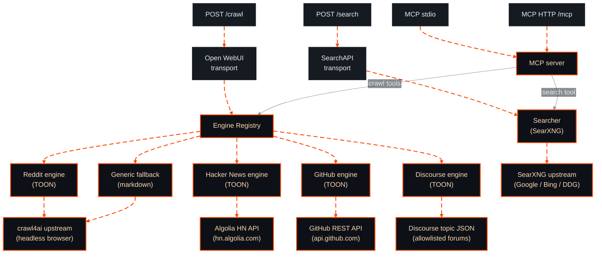

<!-- markdownlint-disable MD033 MD041 -->
<p align="center">
  
</p>

<p align="center">
  
</p>

<p align="center">
  <a href="https://github.com/kinorai/omnifeed/actions/workflows/ci.yml"></a>
  <a href="https://github.com/kinorai/omnifeed/releases"></a>
  <a href="https://hub.docker.com/r/kinorai/omnifeed"></a>
</p>

<p align="center">
omnifeed gives an AI agent the full research loop, <b>search → URLs → content</b>, on self-hosted
<a href="https://github.com/searxng/searxng">SearXNG</a> and <a href="https://github.com/unclecode/crawl4ai">crawl4ai</a>.
Its <b>Reddit engine</b> returns full comment trees as <a href="https://github.com/toon-format/toon">TOON</a>,
lossless and about 40% fewer tokens than JSON, with <b>no Reddit API key</b>. Hacker News, GitHub, Bluesky and Discourse
get their own engines too.
</p>

- **`web_search`** queries SearXNG (Google, Bing, DDG, Reddit included) and returns ranked URLs with titles and snippets. Pass `site` to scope results to one hostname. Naming the site in the query text fails, because engines read it as a topic word.
- **`fetch_url`** returns any URL as clean markdown through crawl4ai. Dedicated engines return TOON instead: Reddit threads and `/r/{sub}` listings through a real browser (listings honor the URL's `?t=` and `?limit=`), plus Hacker News, GitHub issues and pull requests, Bluesky posts and profiles, and Discourse topics from their public APIs.


##  Why omnifeed

| | omnifeed | Cloud web MCPs and other Reddit MCPs |
|---|---|---|
| Works on Reddit | ✅ your residential IP + real browser | ❌ datacenter IPs get 403 |
| Search and crawl in one self-hosted service | ✅ SearXNG + crawl4ai | ❌ search-only or crawl-only |
| Full comment tree (`/api/morechildren` expansion) | ✅ up to 40 rounds, about 4k comments | ❌ |
| Token-efficient output | ✅ TOON, about 40% smaller than JSON | ❌ verbose JSON or truncated bodies |
| Generic crawl for non-Reddit URLs | ✅ via crawl4ai | ❌ |
| Front-ends | MCP, Open WebUI, REST | MCP only, mostly |


##  Quick start

```bash
# Fetch the compose file and SearXNG settings, then start:
curl -fsSL https://raw.githubusercontent.com/kinorai/omnifeed/main/docker-compose.yml -o docker-compose.yml
curl -fsSL --create-dirs https://raw.githubusercontent.com/kinorai/omnifeed/main/searxng/settings.yml -o searxng/settings.yml
docker compose up
```

This starts omnifeed, SearXNG and crawl4ai, <b>tokenless out of the box</b>, because the compose file sets `OMNIFEED_DEV_NO_AUTH=true`. `searxng/settings.yml` enables the `json` format that `web_search` needs. For Open WebUI, set `WEB_LOADER_ENGINE=external` and point it at `http://localhost:8080`. To require a token, see **Authentication** below.

**On Apple Silicon** you can skip Docker and use Apple's native [`container`](https://github.com/apple/container) runtime. See **[docs/apple-container.md](docs/apple-container.md)**.

###  As an MCP server

Works with any MCP client, including **Claude Code, Cursor, Codex, Gemini CLI, OpenCode, Windsurf and Pi**. One endpoint serves the stateless MCP protocol and the older initialize-era revisions. Stateless requests get the spec's HTTP statuses, 400 for header or version violations and 404 for unknown methods. Initialize-era responses stay 200. omnifeed rejects cross-origin browser requests unless [`OMNIFEED_ALLOWED_ORIGINS`](docs/configuration.md) lists them.

**HTTP, recommended.** `docker compose up` already serves MCP on `:8081`. Point your client at it:

```jsonc
{ "mcpServers": { "omnifeed": { "url": "http://localhost:8081/mcp" } } }
```

**Stdio, for clients that speak nothing else.** The client spawns and owns a stdio server, so it can't be a long-running compose service. Launch the compose file's `mcp` profile instead, which reuses its upstreams, network and image:

```jsonc
{
  "mcpServers": {
    "omnifeed": {
      "command": "docker",
      "args": ["compose", "-f", "/abs/path/to/docker-compose.yml", "run", "-T", "--rm", "mcp"]
    }
  }
}
```

`run -T` disables the TTY so JSON-RPC pipes cleanly. Start the stack first with `docker compose up -d` so the upstreams are healthy.

<details>
<summary><b>Standalone stdio, without the compose stack</b></summary>

Spawn the container and tell it where crawl4ai and SearXNG are. omnifeed exits at startup without `OMNIFEED_CRAWL4AI_URL`.

```jsonc
{
  "mcpServers": {
    "omnifeed": {
      "command": "docker",
      "args": [
        "run", "--rm", "-i",
        "-e", "OMNIFEED_CRAWL4AI_URL=http://host.docker.internal:11235/crawl",
        "-e", "OMNIFEED_SEARXNG_URL=http://host.docker.internal:8080",
        "kinorai/omnifeed:latest", "--mcp-stdio"
      ]
    }
  }
}
```

On Linux, add `"--add-host=host.docker.internal:host-gateway"` to the args.
</details>

**`fetch_url`** is always available. **`web_search`** appears only when `OMNIFEED_SEARXNG_URL` is set. The agent calls `web_search`, picks URLs, then calls `fetch_url`.

`/crawl` returns `[{"page_content": "...", "metadata": {...}}]`, the shape of a LangChain or LlamaIndex `Document`, so a custom document loader takes a few lines.

###  Authentication

The compose stack runs **tokenless** for local use. To require a bearer token, generate one:

```bash
openssl rand -hex 32
```

Set `OMNIFEED_API_KEY` to it in `docker-compose.yml` and remove `OMNIFEED_DEV_NO_AUTH`. Clients send it as `Authorization: Bearer <token>`. With neither variable set, omnifeed **refuses to start**, so it can't be left open by accident. Stdio MCP needs no token. It inherits the trust of the process that spawned it.


##  Configuration

omnifeed reads `OMNIFEED_`-prefixed environment variables. You usually **set only three**: `OMNIFEED_API_KEY`, `OMNIFEED_CRAWL4AI_URL` and, for search, `OMNIFEED_SEARXNG_URL`.

**[docs/configuration.md](docs/configuration.md)** lists every variable, plus fetch truncation (`max_chars` and `start_char`), infinite-scroll fetching, Reddit size limits and Prometheus metrics.

**Running more than one replica?** Set `OMNIFEED_REDIS_URL` so the rate limiters share state and the deployment obeys one limit. Without it, N replicas send N times the configured rate, which upstream search engines notice. If Redis goes down, the limiters fall back to per-process pacing and crawls keep working.


##  Architecture



###  Reddit anti-bot handling

Reddit 403-blocks non-browser HTTP clients. The Reddit engine drives a **real headless browser** to a `www.reddit.com` page and fetches Reddit's JSON from inside it, with no auth, cookies or API key. Sustained scraping can still raise your IP's risk score, so slow down if fetches return the block page. [Details and tuning](docs/configuration.md#reddit-anti-bot-handling).

###  Extending it

Engines, searchers, MCP tools and transports each plug into one small port. **[AGENTS.md, Adding things](AGENTS.md#adding-things)** has the steps.


##  Development

```bash
git clone https://github.com/kinorai/omnifeed.git && cd omnifeed
make check        # vet + lint + test, hermetic: no upstreams or token needed
docker compose up # full stack, tokenless, ports 8080 / 8081 / 9090
```

See [CONTRIBUTING.md](CONTRIBUTING.md) for the workflow and [SECURITY.md](SECURITY.md) to report a vulnerability. Coding agents read [AGENTS.md](AGENTS.md).

Prometheus metrics are on `:9090/metrics`. [docs/configuration.md](docs/configuration.md#prometheus-metrics) lists them.


##  Contributing

<div align="center">

**If omnifeed is useful, star it so others find it.**

[](https://github.com/kinorai/omnifeed)
[](https://github.com/kinorai/omnifeed/issues/new)
[](https://github.com/kinorai/omnifeed/pulls)

</div>

New engines, searchers, MCP tools and transports are welcome. Start with [AGENTS.md](AGENTS.md#adding-things) and [CONTRIBUTING.md](CONTRIBUTING.md).

##  License

[MIT](LICENSE) © kinorai


